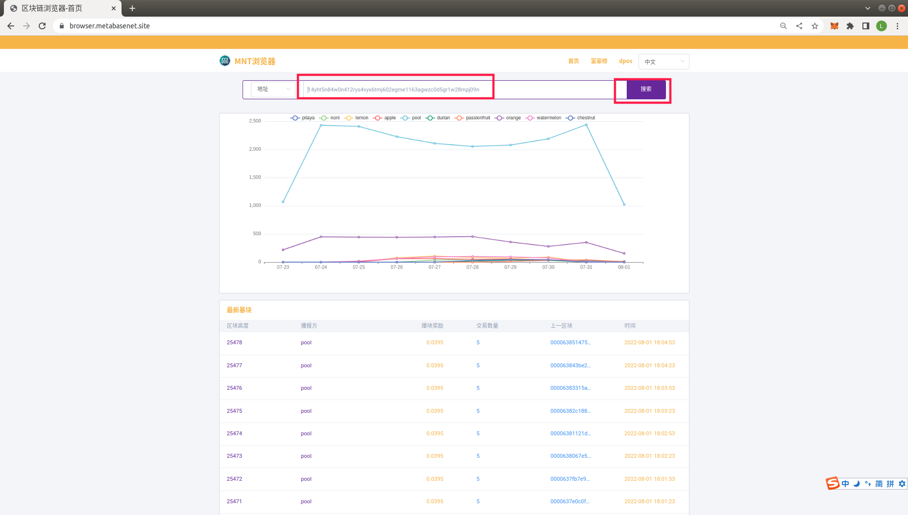
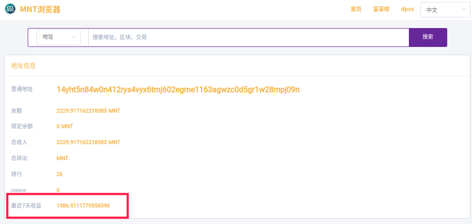

查询地址及其推广的子孙后代收益说明
在浏览器中输入网址  https://browser.metabasenet.site/
在搜索栏中粘贴您要查询的地址，（搜索栏可以搜索地址，区块，交易，默认搜索地址），点击 搜索 按钮，可以查看您要搜索的地址的详细明细
>普通地址： 普通详细地址
最近7天收益：此数据描述的是该地址和其推广的子孙后代地址近7天投票收益和推广收益的总和，不是本地址近7天收益总和
最近7天收益详见 截图2的 最近7天收益数据

举例
假如 A，B，C 三人共同投票了该dpos节点， 经过查询
>A的最近7天收益为 10
B的最近7天收益为 20
C的最近7天收益为 30
则A的收益率为 10/(10+20+30)=17%
B的收益率为 20/(10+20+30)=33%
C的收益率为 30/(10+20+30)=50%
然后根据每人的收益率计算收益即可

