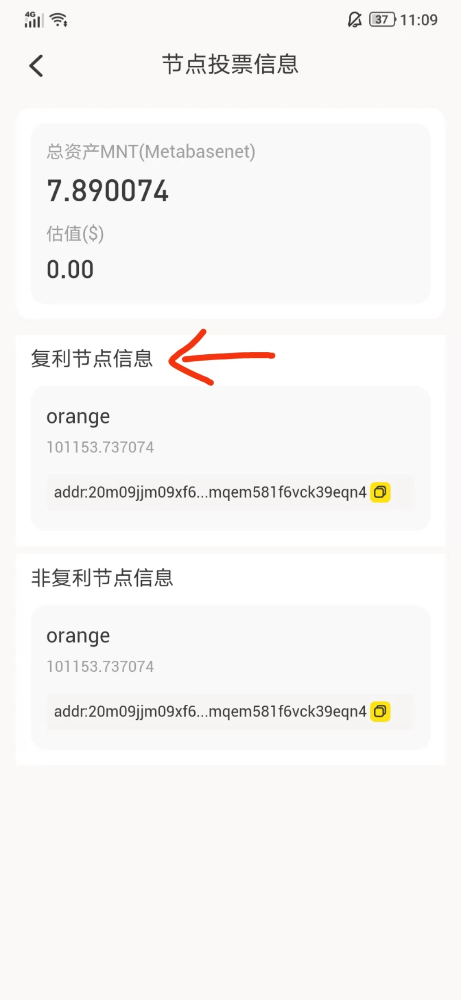

 投票模式分为复利和非复利。复利模式是投票收益打到投票地址，投票地址金额增多，投票收益会更多。非复利模式是投票收益打到普通地址，投票收益不会增多。
 #### 1）复利投票： 
  &emsp; &emsp;用户可以点击复利节点信息下的节点进入投票页面进行投票，撤投，转投，赎回。
  复利节点信息
  
 #### 2）非复利投票： 
  &emsp; &emsp;用户可以点击非复利节点信息下的节点进入投票页面进行投票，撤投，转投，赎回。
  非复利节点信息